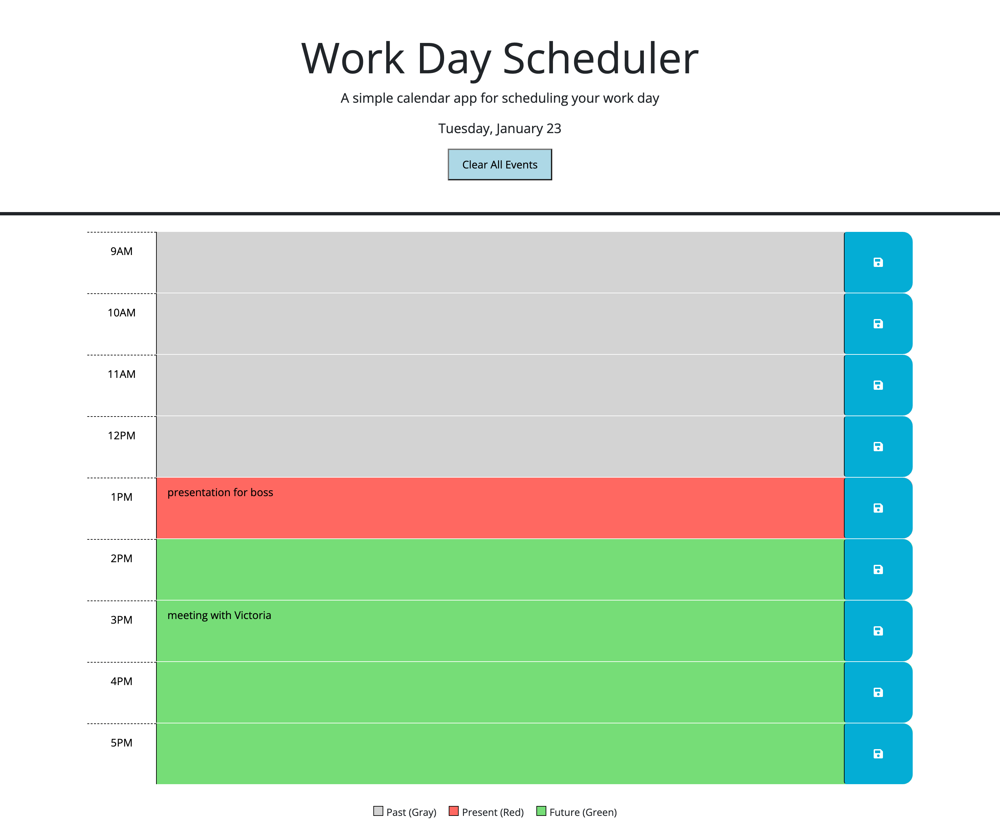

# Work Day Scheduler

## Table of Contents
- [Description](#description)
- [Project Background](#project-background)
- [Deployed Application](#deployed-application)
- [Usage](#usage)
- [Screenshots](#screenshots)
- [Testing](#testing)
- [Author and Acknowledgment](#author-and-acknowledgement)

## Description

The Work Day Scheduler is a browser-based application designed to help manage daily tasks and events within standard business hours. This tool provides an intuitive interface for adding, saving, and viewing appointments or tasks hour by hour for a 9am - 5pm workday.

- **Motivation:** The motivation behind the Work Day Scheduler was to create a tool that could help improve productivity and time management for individuals with busy schedules.
- **Purpose:** The purpose of this application is to offer a simple and effective way to organize the workday, helping users to keep track of their various appointments and commitments.
- **Problem It Solves:** This application addresses the common problem of managing numerous tasks throughout the day without missing any important events. It provides a clear visual representation of the day's schedule, with color-coded time blocks indicating past, present, and upcoming activities.
- **What I Learned:** Developing this application deepened my understanding of third-party APIs, local storage, the power of jQuery for DOM manipulation, and how to effectively use libraries such as Day.js to handle dates and times. It also reinforced my knowledge of JavaScript, CSS, and HTML.

## Project Background
The Work Day Scheduler project was initiated as part of the Columbia University Fullstack Coding Bootcamp. Starter code, which included the basic HTML and CSS setup, was provided by the bootcamp. My contribution involved building upon this foundation and writing the JavaScript necessary to bring the dynamic scheduling features to life. This involved tasks such as implementing the Day.js library to work with date and time, enabling the saving of events to local storage, and updating the UI in real-time to reflect these changes.

## Deployed Application
The deployed application can be viewed here: [https://ktotah.github.io/ktotah-day-planner/](https://ktotah.github.io/ktotah-day-planner/)

## Usage
To use the Work Day Scheduler, follow these steps:

1. Open the [deployed application](#deployed-application) in your browser.
2. Click into a time block for the desired hour.
3. Enter the event details and click the save button for that time block.
4. The event will be saved and persist even after the browser is closed or refreshed.

## Screenshots

Here is a screenshot of the deployed application:

### Scheduler Overview

### Event Entry

## Testing

Comprehensive testing was conducted to ensure robustness, including:

1. Checking that the current day is displayed correctly.
2. Verifying that time blocks are color-coded accurately according to past, present, or future.
3. Confirming that clicking the save button stores the event correctly in local storage.
4. Ensuring that upon refreshing the page, the saved events are retrieved and displayed.

For further testing, you can manually test the application by following the [usage instructions](#usage) above.

## Author and Acknowledgment
- **[Katy Totah]** - *Initial work* - [Katy Totah](https://github.com/ktotah)

## License
This project is licensed under the [MIT License](link-to-your-license-file).